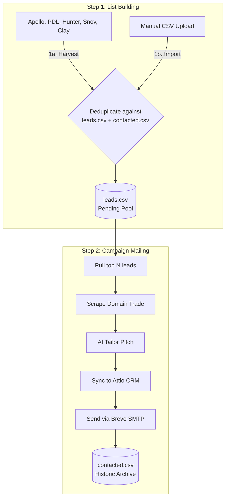

# AIMS Outbound Marketing & Lead Generation Engine

**Automated Lead Ingestion, AI Domain Research, CRM Synchronization, and Hyper-Personalized Delivery.**

This repository implements the automated marketing skill for **AIMS** (Agentic AI Business Transformation for Singapore SMEs). It operates as a streamlined, fallback-safe outbound pipeline that harvests new leads, executes domain-level research, synchronizes profiles with **Attio CRM**, and delivers highly tailored cold emails via **Brevo SMTP**.

---

## 📐 The Simplified 2-Step Architecture

The system segregates lead gathering from outreach delivery to give you full transparency and control over your target lists.



---

## 🛠️ Key CLI Commands (`./tools/run-outbound`)

The main interface is the executable script `./tools/run-outbound`.

| Parameter | Type | Description |
| :--- | :--- | :--- |
| **`--harvest <N>`** | Integer | **Step 1a**: Automated API crawlers (Apollo, PDL, Hunter, Snov, Clay) fetch $N$ new Singapore leads (excl. CTOs), de-duplicate, and append them to `leads.csv`. |
| **`--import <path.csv>`** | Path | **Step 1b**: Import a custom CSV list of prospects. Filters out duplicates, excludes CTO positions, and appends unique records to `leads.csv`. |
| **`--count <N>`** | Integer | The limit of prospects to process in the Step 2 campaign (default: `200`). |
| **`--draft-only`** | Flag | **[DEFAULT]** Personalizes campaign emails and compiles them locally to `output/leads/drafts_today.json` for review without sending or moving files. |
| **`--test <email>`** | String | Personalizes emails for real prospects from `leads.csv` but redirects final delivery to your specified test inbox. Archives processed rows to `contacted.csv`. |
| **`--send`** | Flag | **LIVE CAMPAIGN**: Sends customized emails to actual prospects via Brevo, upserts them in Attio CRM (status='contacted'), and archives them to `contacted.csv`. |

---

## 🚀 Quick Start Guide

### 1. Configure Credentials
Copy `.env.sample` to `.env` and fill in your API keys:
```bash
cp .env.sample .env
# Edit .env and supply keys for Apollo, Hunter, PDL, Snov, Clay, Brevo, Attio, and OpenAI
```

### 2. Step 1: Ingest Your Prospects
Harvest 10 new high-quality SME leads from the automatic lead generators:
```bash
./tools/run-outbound --harvest 10
```
*You can open `output/leads/leads.csv` to review, clean, or enrich your prospects list.*

### 3. Step 2: Run a Safe Test Campaign
Create personalized pitches for 2 leads, routing final emails directly to your own inbox:
```bash
./tools/run-outbound --count 2 --test developer@aims-sg.com
```

### 4. Step 2: Dry-Run Draft Mode
Review personalizations for the top 10 prospects without executing any API writes or sends:
```bash
./tools/run-outbound --count 10 --draft-only
```
*Generated content is saved directly to `output/leads/drafts_today.json`.*

### 5. Step 2: Run Your Live Campaign
When you are ready to deliver highly-tailored campaigns to your prospects and sync them to **Attio CRM**:
```bash
./tools/run-outbound --count 200 --send
```

---

## 📂 File Directory

*   **[`lib/leads_engine.py`](file:///home/openclaw/skill-marketing/lib/leads_engine.py)**: The underlying core logic handling API connectors, de-duplication, AI email personalization, Attio updates, and Brevo delivery.
*   **[`tools/run-outbound`](file:///home/openclaw/skill-marketing/tools/run-outbound)**: The direct command-line utility wrapping python operations.
*   **`output/leads/`**:
    *   `leads.csv`: Central pending pool of prospects waiting to be emailed.
    *   `contacted.csv`: Historic archive of emailed leads (used for absolute de-duplication).
    *   `drafts_today.json`: Location where `--draft-only` outputs are compiled.
