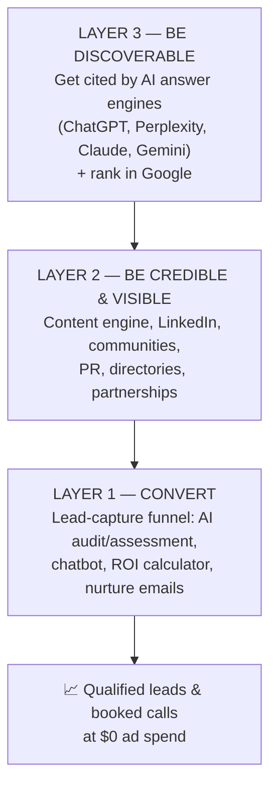
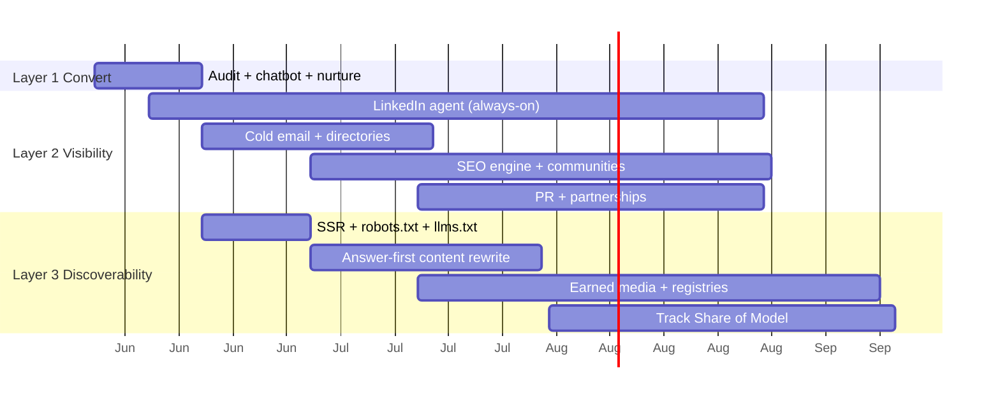
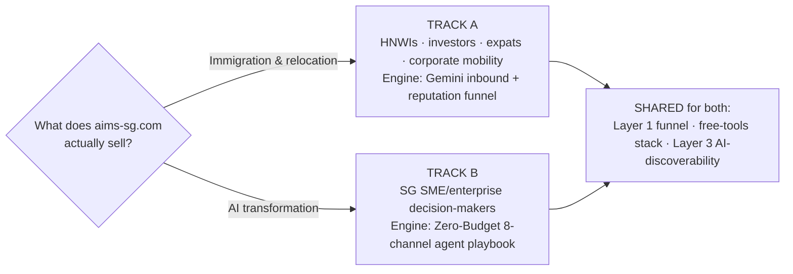

# AIMS‑SG — Organic Growth Master Report
### Growing aims‑sg.com with $0 ad spend, using AI agents (like Zo) to execute

*Compiled from four source documents · June 2026*

---

## How to read this report

This single report combines, de‑duplicates, and re‑organises **four separate documents** you provided into one playbook:

| # | Source file | What it contributed |
|---|-------------|---------------------|
| 1 | `AIMS_SG_No_Ads_Growth_Playbook.pdf` | The lean "build‑first" plan — 4 product priorities + 7‑day sprint |
| 2 | `AIMS-SG Zero-Budget AI Agent Promotion Playbook.docx` | The 8‑channel agent playbook + free‑tools list + Singapore grant intel |
| 3 | `Gemini Enterprise.docx` | The inbound/reputation funnel + a key correction about *what the business actually is* |
| 4 | `Strategic Implementation Roadmap...docx` | The advanced layer: getting cited by ChatGPT/Perplexity/Claude (AEO/GEO) |

> ### ⚠️ Read this first — a contradiction in your own source files
> Three of the four documents assume **aims‑sg.com is an "AI business transformation consultancy."** The Gemini document, however, reports that research shows **AIMS is an established immigration & relocation firm (operating since November 2006, ~10–11 offices across Asia Pacific).** A quick verification confirms the latter: aims.sg presents as *"AIMS Immigration & Relocation Specialist,"* covering skilled migration, the Global Investor Programme (GIP), EntrePass, Employment Pass, family visas, relocation, and education services.[^1][^2]
>
> **This matters because the whole strategy changes depending on who your buyer is.** This report keeps both tracks but is structured so you decide once, up front:
> - **Track A — Immigration & Relocation** (HNWIs, investors, expats, corporate mobility) → use the *Gemini* funnel.
> - **Track B — AI Transformation** (Singapore SME/enterprise decision‑makers) → use the *Zero‑Budget agent* playbook.
>
> The **execution engine, free‑tools stack, and AI‑discovery layer apply to both.** Confirm your real positioning before you build, so your agents target the right keywords and the right people.

---

## 1. The big picture: three layers of organic growth

Everything in your four documents collapses into **three layers**. Think of it as a funnel that an AI agent (Zo) can build and run for you:

- **Layer 1 (Convert)** comes from the **PDF** + **Gemini** docs — capture and nurture the traffic you already get.
- **Layer 2 (Be credible & visible)** comes from the **Zero‑Budget playbook** — the 8 promotion channels.
- **Layer 3 (Be discoverable)** comes from the **Strategic Roadmap** — the newest, highest‑leverage idea: buyers now ask AI assistants *first*, so you must be the brand the AI recommends.

The smart sequencing is **bottom‑up**: build the conversion funnel first (so no hard‑won traffic leaks), then drive visibility, then play the long game of AI‑discoverability.

---

## 2. Why this works right now (the evidence)

**The market is actively buying.**
- Singapore's **National AI Impact Programme** targets **10,000 SMEs** over 3 years; the **Champions of AI Programme** pushes enterprise adoption. (Relevant to Track B.)
- Singapore remains a top destination for skilled migration and investor visas (GIP, EntrePass, EP), with steady HNWI inflows. (Relevant to Track A.)

**Discovery has moved to AI.** From your Strategic Roadmap:
- **AI referral traffic grew 527% year‑over‑year.**
- **80%** of users rely on AI summaries instead of clicking source links; **60%** of searches now end with **zero clicks**.
- But AI‑referred visitors convert **4.4×–9× higher** than traditional search — **ChatGPT referrals convert at ~15.9%** vs Google organic's **~1.76%**.
- **82%** of links cited by AI engines come from **earned media** (third‑party coverage), and **~85%** of citations for broad B2B categories come from third‑party sources.

**Translation:** fewer clicks, but far higher‑intent ones — *if* you're the brand the AI names. That's the strategic prize.

---

## 3. LAYER 1 — Convert (build this first)

> Goal: make every visitor worth more. This is the fastest path to results and the foundation everything else feeds into.

### The four products to build (from the PDF "build‑first" plan)

| Priority | Product | What it does | Captures |
|---------|---------|--------------|----------|
| **#1** | **Lead‑Capture Funnel** | A free **AI Business Audit / Readiness Assessment** form (company, industry, pain point, email, goal). Auto‑saves to Google Sheets, sends a confirmation email, pings you. | Email + qualifying data |
| **#2** | **Outreach Assistant** | Upload prospect lists → generate personalised emails / LinkedIn messages. **Human review before send.** | — (powers Layer 2) |
| **#3** | **AI ROI Calculator** | Visitors estimate time/cost savings; capture the lead **before** revealing the full report. | Email at peak intent |
| **#4** | **Content Repurposing Tool** | Turn one idea into LinkedIn posts, emails, FAQs, and web copy to publish consistently. | — (powers Layer 2) |

**Recommended first build:** the **AI Business Audit Generator** — user enters company details and receives AI opportunities, estimated savings, and a consultation CTA. *(For Track A, this becomes a free "Immigration / Relocation Eligibility Assessment" — same mechanic, different questions.)*

### The on‑site chatbot (from the Zero‑Budget playbook, Strategy 8)
- Greets visitors, asks 2–3 qualifying questions, recommends a relevant service, offers the free assessment, and books a call via **Calendly (free)**.
- Logs leads to **Google Sheets**, sends confirmation via **Brevo (free)**.
- Expected lift: **10–30%** of engaged visitors converted vs. the typical 1–3% with no chatbot.

### The nurture sequence (from Gemini — turns a download into a consultation)
A 4‑email automated workflow (built in **MailerLite/Brevo free tier**, drafted with AI):

| Email | Timing | Purpose |
|------|--------|---------|
| 1 — Deliver & welcome | Day 0 | Hand over the guide/assessment; set expectations |
| 2 — Value‑add tip | Day 2–3 | A "common mistake to avoid" not in the guide (e.g. *"3 pitfalls on your EP application"*) |
| 3 — Social proof | Day 5–7 | A short, anonymised, consented client success story |
| 4 — Direct offer | Day 10–14 | Book a free, no‑obligation consultation; light urgency (limited slots) |

> **Rule throughout:** AI drafts, a human expert edits and fact‑checks. For an immigration firm especially, accuracy is non‑negotiable.

---

## 4. LAYER 2 — Be credible & visible (the 8 promotion channels)

These are the eight agent‑driven channels from the Zero‑Budget playbook, re‑ordered by the playbook's own priority ranking. Each can be built and run by an AI agent.

| Order | Channel | Effort | First results | One‑line description |
|------|---------|--------|---------------|----------------------|
| 1 | **LinkedIn AI Agent** | Low | 2–4 wks | Highest‑ROI B2B channel in SG. 3–5 thought‑leadership posts/week + drafted comments + targeted connection requests. |
| 2 | **AI Cold Email Outreach** | Medium | 1–3 wks | Hyper‑personalised, industry‑specific emails + 3‑email follow‑up over 2 weeks. |
| 3 | **On‑Site Lead Capture Bot** | Medium | Immediate | *(Layer 1 — listed here for priority context.)* |
| 4 | **SEO Content Engine** | Low | 6–12 wks | Auto‑generate long‑tail SEO posts; cross‑post to Medium, Hashnode, Substack (free). |
| 5 | **Community Participation** | Low | Ongoing | Genuine expert answers on Reddit, Quora, LinkedIn Groups → authority + backlinks. |
| 6 | **Directory Listings** | Very low | 2–4 wks | 20–40 free backlinks (Product Hunt, G2, Capterra, Clutch + SG directories). |
| 7 | **PR Agent (HARO/Qwoted)** | Medium | 4–8 wks | Daily monitor journalist queries; draft expert quotes → free press + authority links. |
| 8 | **Partnership Outreach** | Medium | 4–8 wks | Co‑webinars, co‑authored content, referral deals with non‑competing SG firms. |

### Channel notes that matter most

**Channel 1 — LinkedIn (your single best lever).** Weekly cadence:
- **Mon** — industry insight post · **Wed** — quick tip / myth‑bust · **Fri** — case study / results story.
- *Track B targets:* CTOs, CDOs, CEOs, Heads of Digital at SG SMEs (50–500 staff).
- *Track A targets:* founders, investors, HR/global‑mobility managers, expatriate community groups.

**Channel 4 — SEO keywords** (Track B examples): *"AI transformation consultant Singapore", "SME AI adoption Singapore", "PSG AI grant consultant Singapore."* (Track A examples): *"Singapore GIP requirements", "EntrePass business plan", "Employment Pass application Singapore", "Singapore relocation checklist."*

**Channel 6 — directories worth prioritising:** Product Hunt, G2, Capterra, Clutch (global) + **SGPGrid, SGPBusiness, Startup SG, SMEPortal.sg, builtinsingapore.com** (Singapore — these double as the *entity‑validation registries* AI engines crawl, so they also serve Layer 3).

**Channel 7 — PR targets:** Tech in Asia, e27, The Business Times, The Straits Times, CNA. Free distribution via PRLog, OpenPR, EIN Presswire (1 free/month).

### Content amplification (from Gemini) — one guide → a month of content
Each long‑form guide gets repurposed by AI into LinkedIn articles, Facebook posts, graphics (Canva Magic Studio), and 30–60s video scripts → videos (Fliki/Pictory/VEED free tiers). For free‑tier watermarks, **cover with a branded lower‑third** (recommended) rather than risky removal. The Gemini doc includes a worked 4‑week calendar built from a single GIP guide — a ready‑made template for Track A.

---

## 5. LAYER 3 — Be discoverable by AI (the long‑game advantage)

> This is the most forward‑looking material in your set (the Strategic Roadmap). Most competitors aren't doing it yet — which is exactly why it's worth doing.

The discipline is **Machine Relations (MR)**: making your brand *citable, retrievable, and legible* to AI models so they recommend you. Three optimisation targets sit alongside classic SEO:

| | Traditional SEO | Answer Engine Optimization (AEO) | Generative Engine Optimization (GEO) |
|---|---|---|---|
| **Goal** | Rank in result lists | Win the direct "answer box" | Get cited inside AI synthesis |
| **Where** | Google, Bing | AI Overviews, snippets | ChatGPT, Perplexity, Claude, Gemini |
| **Win =** | Top‑10 / organic click | Selected as the answer | Cited (often even outside top 10) |

### The five‑layer Machine Relations stack
1. **Earned Authority** — third‑party coverage (the non‑negotiable foundation; 82% of AI citations are earned media).
2. **Entity Clarity** — consistent identity everywhere so models don't hallucinate or confuse you (*especially important given the "AIMS" name is shared by multiple firms*).
3. **Citation Architecture** — "answer‑first" on‑page content built for machine extraction.
4. **Distribution** — seed content across AI‑indexed surfaces (Reddit, G2, registries).
5. **Measurement** — track **Share of Model (SoM)**.

### Content engineering that gets you cited (Princeton findings)
| Tactic | Visibility increase |
|--------|--------------------:|
| Cite authoritative sources | **+40%** |
| Add statistics / numerical data | **+37%** |
| Include expert quotations | **+30%** |
| Use precise technical terms | **+28%** |

Plus the practical checklist:
- **"Answer Block":** open every section with a self‑contained **30–80 word** answer right after the heading.
- **Data density:** comparison tables & structured lists are cited **2.5× more** than prose.
- **GEAF layout:** Grabber → Explainer → Anticipate objections → Finish strong.
- **Schema:** deploy `FAQPage`, `QAPage`, `ProfessionalService` JSON‑LD.
- **Prompt‑style URLs** and **declarative/question headers**.

### Technical must‑dos
- **Server‑Side Rendering (SSR)** is non‑negotiable — **69% of AI crawlers can't run JavaScript**, so a client‑side‑only site is invisible to them.
- **Surgical `robots.txt`:** *allow* real‑time citation bots (OAI‑SearchBot, Claude‑SearchBot, **PerplexityBot** — Perplexity has no separate training bot, so never block it), and decide deliberately about bulk training bots (GPTBot, ClaudeBot, Google‑Extended).
- Publish an **`llms.txt`** (and `llms-full.txt` if API‑heavy) at the root, served as `text/markdown`.

### The Reddit + registries vector
Perplexity draws **~46.7%** of its citations from Reddit; ChatGPT also weights community consensus heavily. Earn organic Reddit mentions and keep **G2, Capterra, SGPGrid, SGPBusiness, builtinsingapore.com** profiles consistent and current.

### Measuring it — Share of Model (SoM)
**SoM = (your brand citations ÷ total citations for category queries) × 100.** Track 20–50 specific buyer prompts (e.g. *"best Singapore immigration consultant for GIP"* or *"AI transformation consultant Singapore"*), and watch **ICP alignment** and **sentiment delta** vs competitors — not just raw citation count. ChatGPT handles ~87.4% of AI referral traffic, so it's the primary surface to track.

**Pitfalls to avoid:** ghost citations (used as a source but not named), JS barriers (no SSR), the freshness trap (65% of bot activity targets content <1 year old), IP‑block overkill, and neglecting third‑party authority.

---

## 6. The free tools stack (one consolidated list)

| Tool | Purpose | Free tier |
|------|---------|-----------|
| **Claude API / ChatGPT / Gemini / Copilot** | Content, outreach, personas, drafting | Free credit / free tier |
| **n8n (self‑hosted)** | Workflow automation | Fully free |
| **Apollo.io** | Lead prospecting | 50 exports/month |
| **Clay** | Lead enrichment | Free tier |
| **Brevo** | Email sending & automation | 300 emails/day |
| **MailerLite** | Email list & nurture sequences | Free tier |
| **Phantombuster** | LinkedIn automation | 10 min/day |
| **Calendly** | Meeting booking | 1 calendar |
| **Google Sheets** | Lead tracking | Free |
| **Canva Magic Studio** | Graphics from takeaways | Free tier |
| **Fliki / Pictory / VEED.io** | Script → video | Free tier (watermarked) |
| **HARO / Qwoted / Connectively** | Journalist queries (PR) | Free |
| **PRLog / OpenPR / EIN Presswire** | Press distribution | Free / 1 per month |
| **Product Hunt · G2 · Capterra · Clutch** | Directory listings | Free |
| **Google Alerts / Talkwalker / Brand24** | Brand monitoring | Free tier |
| **Senja / Survicate** | Testimonial collection | Free tier |
| **Conviora / Fibr AI / WordLift Audit** | Website & AEO analysis | Free tier |

> **Note on the "$0 / no‑subscription" goal:** all eight strategies are designed around free tiers, but a few have real limits worth knowing — Apollo caps at 50 exports/month, Brevo at 300 emails/day, Phantombuster at 10 min/day, and video tools add watermarks. Plan volume around these, or rotate tools, to stay genuinely free.

---

## 7. Singapore intelligence (use in content & outreach)

**Track B (AI transformation) — grant hooks your buyers care about:**
- **PSG (Productivity Solutions Grant)** — up to 50% co‑funding for AI/digital solutions
- **Enterprise Development Grant (EDG)** — business transformation projects
- **SkillsFuture Enterprise Credit** — workforce AI upskilling
- **Champions of AI Programme** / **National AI Impact Programme** (10,000 SMEs)

**Track A (immigration/relocation) — programme hooks:**
- **Global Investor Programme (GIP)**, **EntrePass**, **Employment Pass / S Pass / PEP**, family visas, and relocation/education/medical concierge services.

Angle content around helping people *qualify for and navigate* these programmes — that's where high‑intent search and AI queries concentrate.

---

## 8. Your execution roadmap

### Week 1 sprint (from the PDF, expanded)
| Day | Action |
|-----|--------|
| 1–2 | Build the **AI Audit / Assessment Generator** |
| 3 | Add lead capture + Google Sheets + notifications |
| 4 | Build the **outreach helper** |
| 5 | Create **10 LinkedIn posts** |
| 6 | Contact **50 prospects** |
| 7 | Review results & iterate |

### 90‑day arc (merging the playbook priorities + the 3–6 month AI‑discovery roadmap)

- **Month 1 — Foundation & audit:** build Layer 1; run an AI‑visibility audit (baseline SoM); deploy SSR, `robots.txt`, `llms.txt`; turn on the LinkedIn agent.
- **Months 2–3 — Acceleration:** re‑engineer pages "answer‑first"; add data tables; launch cold email + directories; begin earned‑media outreach.
- **Months 4–6 — Maturation:** keep registries/G2/Reddit consistent; publish original research for primary citations; refine by SoM, sentiment, and AI‑referral conversions.

---

## 9. The one decision before you start

Confirm your positioning, point the agents at the right audience and keywords, then build Layer 1 first. Everything else compounds on top of it.

---

[^1]: https://aims.sg/about-aims
[^2]: https://sg.linkedin.com/company/aims-sg
